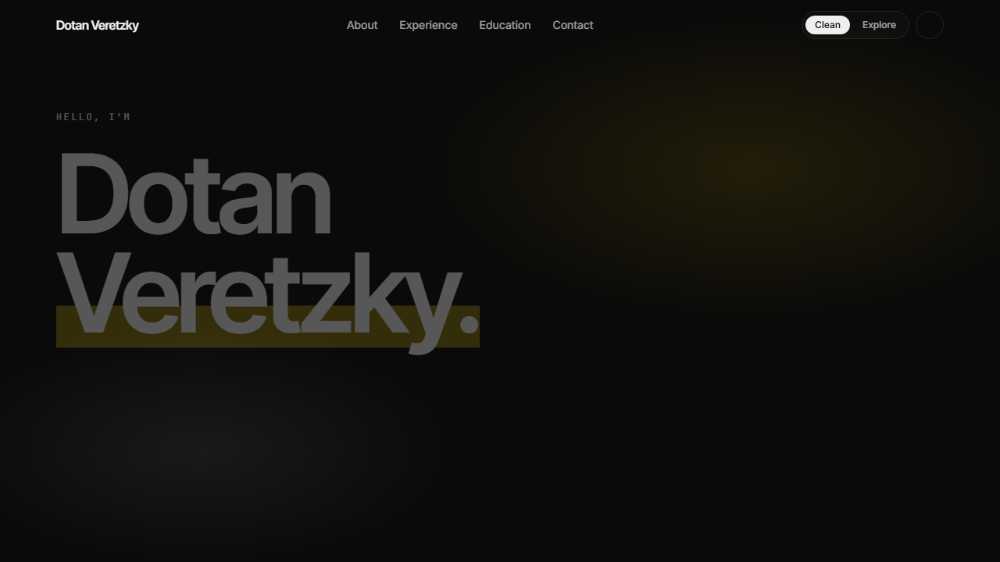

# Dotan Personal Website

Personal portfolio site for Dotan VG, built as a dual-mode experience:

- **Clean mode** presents a polished portfolio with cinematic motion, focused copy, and a structured view of experience and education.
- **Explore mode** turns the same story into an interactive 3D world that visitors can walk through.

[Live Demo](https://dotanv.vercel.app)



## Highlights

- Dual-mode portfolio experience with a quick toggle between **Clean** and **Explore**
- Interactive 3D scenes for the explore experience
- Responsive, animated UI for desktop and mobile
- Built as a modern App Router project with TypeScript

## Tech Stack

- Next.js 15
- React 19
- Three.js
- Tailwind CSS
- Framer Motion

## Run Locally

```bash
npm install
npm run dev
```

Open `http://localhost:3000`.

Additional commands:

```bash
npm run typecheck
npm run lint
npm run build
```

## License

This repository does not currently include an open-source license. Unless a license is added, all rights are reserved.
