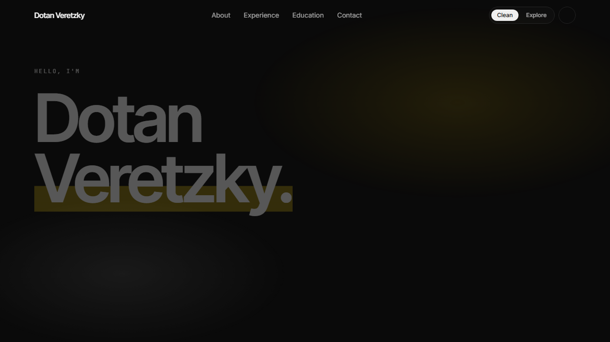

# Dotan Personal Website

Personal portfolio site for Dotan VG, built as a dual-mode experience:

- **Clean mode** presents a polished portfolio with cinematic motion, focused copy, and a structured view of experience and education.
- **Explore mode** is a small driving sandbox: a sunlit coastal city where you walk, take almost any car, drive, crash, and find Dotan's work and study history at eight landmark buildings.

[Live Demo](https://dotanv.vercel.app)



## Highlights

- Dual-mode portfolio experience with a quick toggle between **Clean** and **Explore**
- Interactive 3D scenes for the explore experience
- Responsive, animated UI for desktop and mobile
- Built as a modern App Router project with TypeScript

## Tech Stack

- Next.js 15
- React 19
- Three.js
- Tailwind CSS
- Framer Motion

## Explore mode

Open `/?mode=explore`. Everything plays on a phone held upright as well as with a keyboard.

| | Touch | Keyboard |
|---|---|---|
| Walk / steer | Left thumb | WASD or arrows (Shift runs) |
| Look around | Drag the scenery | Drag with the mouse |
| Enter, exit, read a landmark | Action button | E |
| Gas / brake-reverse / handbrake | Right pedals, Handbrake | W / S / Space |
| Jump | Jump | Space |
| Unstuck car | Unstuck (shown when needed) or menu | R |
| Pause, controls, settings | Menu button | Esc |

- `lib/game/` is the simulation: city layout, fixed-step arcade vehicle physics and collisions, damage, traffic, input. It has no rendering or DOM code and runs under Node in tests.
- `components/explore/` renders it with React Three Fiber and holds the HUD, touch controls and dialogs.
- Landmark lots are keyed by the experience/education slugs in `content/`; a unit test fails if an entry has no landmark.

## Run Locally

```bash
npm install
npm run dev
```

Open `http://localhost:3000`.

Additional commands:

```bash
npm run typecheck
npm run lint
npm run build
npm test            # simulation, input and layout tests (Node >= 22.18)
```

Browser checks run against a production build with a read-only test hook compiled in (the site's CSP blocks the dev server's `eval`, so the dev server can't be used for this):

```bash
npm run build:e2e   # production build + test hook; don't deploy it
npx next start -p 3300
npm run test:e2e    # keyboard loop, multi-touch, layouts, navigation, failure cases
node e2e/perf.mjs   # frame timing while driving
node e2e/soak.mjs   # 10-minute endurance run
```

Screenshots and reports land in `e2e/artifacts/`. Run `npm run build` again before deploying.

## License

This repository does not currently include an open-source license. Unless a license is added, all rights are reserved.
